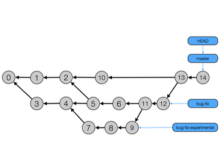

[](https://classroom.github.com/open-in-codespaces?assignment_repo_id=14065152)
# A small git exercise on branching

This exercise asks you to demonstrate your skills with `Git` by creating a `git` repo with the commit graph below:



We want to ensure that each student has taken the time to practice their `git` skills, which are essential for the group assessment (and your future career). Creating a repo, editing files, adding them to the index, making commits, and resolving merge conflicts are much different than watching a video on it!

It should go without saying that you should review the earlier material on `git` before working on this exercise.

## Collaboration

We strongly encourage students to work in their teams for this exercise.

## Instructions

Create a git repo that produces the commit-graph above. This is similar to an example in the notes and will help you demonstrate your knowledge of creating `git` repos, making new commits, creating branches, and merging branches.

The content in the repo should be kept to a minimum. In this case, you will create a `FILE.md` file and include an image as well.

Other than creating the graph above, the other requirements are:

+ That at least one of your merges should generate a *merge conflict* that you have to resolve and, the very last commit on the `master` branch must have an image file that displays the commit-graph prior to the last commit. 
  That is, the image will contain all commits up to commit `13`, but not commit `14`. You will then add the image to the repo to create commit `14`.
+ The very last commit on the `master` branch must also have a `FILE.md` file that contains a list of all the `git` commands you used to create the entire repo, starting with the `git init` command and ending with the `git add <image_file> FILE.md`; git commit commands that were used to check in the final change of `FILE.md` on the `master` branch.

Since you have 15 commits, we recommend having your commit messages reference the commit you are creating. That is, your first commit message should include a reference to `Commit 0,` while your fourth commit message will have a reference to `Commit 3` and so on. This will allow you to track what commits you have created and what you need to do next!

When working on this problem myself, I found it helpful:

+ To number my commands in the `FILE.md` file and to build up the list of commands incrementally as I created the commits. 
  (Things get confusing when dealing with the multiple branches but having numbered commands helps with that.)
+ To add lines like `[EDIT FILE.md]` to my list of commands to indicate when in the command history I edited a file, and 
+ To add indications of what branch I was on when I issued a command.

**Note**: when you add commands to the `FILE.md` file, you will need to add a `<br>` tag at the end of each one, so they display properly when converted to `HTML`.

As you are working with your repo, you can run the command `git log --graph` to see the graph that is being created. You can also use other git graph visualisation tools, similar to `GitUp`, to keep track of the commit-graph that you are creating. 

**Note**: `GitHub` can display the commit-graph. 
If you use it to generate your image by taking a screenshot, do not include the commands you used to upload the repo to `GitHub` in your `FILE.md` file.

Once you have your repository in the final state, you should then upload it to `GitHub` (using `git push` to upload an existing repository to `GitHub`).

**IMPORTANT**: When uploading the repository to `GitHub`, you need to make sure that you upload **all** three branches. To do that, perform the following steps:

Create an empty repo on `GitHub` then:

```shell
git checkout master
git remote add origin <GitHub URL> 
git push -u origin master
git checkout bug-fix
git push -u origin bug-fix
git checkout bug-fix-experimental
git push -u origin bug-fix-experimental
git checkout master
```

### Credits

Thanks to XXXX at the University of YYY for the basis of this exercise.
